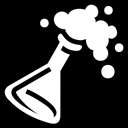
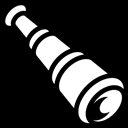



    

        

            
        

        

            <h1>Daily Delirium</h1>
            

                A procedurally generated side scroller, that changes everyday!! Currently only
                available for Android. I will be looking into iOS when I can afford to buy
                apple's dev account.
            

            

                <a class="btn btn-primary btn-lg" role="button" href="https://play.google.com/store/apps/details?id=com.mentallydefective.dreamtime.beta">Get it on Google Play</a>
                <a class="btn btn-lg" role="button" href="http://defektivedevelopment.github.io/daily-delirium/">View Game Site</a>
            

        

    

    

        

            

                
            

            

                <h3>Wanna beta test?</h3>
                <a class="btn btn-primary btn-lg" role="button" href="https://plus.google.com/u/0/communities/101377362410558937167">Become a tester</a>
            

        

    

    

        

            

                
            

            

                <h3>Find a Bug?</h3>
                <a class="btn btn-primary btn-lg" role="button" href="https://github.com/DefektiveDevelopment/daily-delirium/issues">Log it!</a>
            

        

    

    

        

            

                
            

            

                <h3>What's coming?</h3>
                <a class="btn btn-primary btn-lg" role="button" href="https://trello.com/b/7KxTZkem/daily-delirium-secret-robot-development">View Trello</a>
            

        

    

